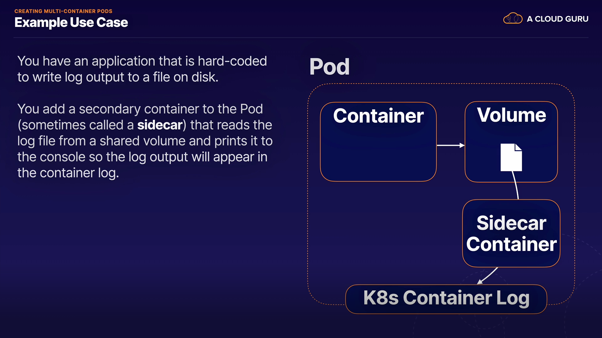

# Creating Mulit-Container Pods

> Kubernetes Pods can have more than one container. In this lesson, we will discuss multi-container Pods. We will talk about how and why they are used, and we will demonstrate how to create multi-container Pods and how to use sidecar containers.

## Relevant Docs

- [Using Pods](https://kubernetes.io/docs/concepts/workloads/pods/#using-pods)

- [Shared Volumes](https://kubernetes.io/docs/tasks/access-application-cluster/communicate-containers-same-pod-shared-volume/)

- [Patterns for Composite Containers](https://kubernetes.io/blog/2015/06/the-distributed-system-toolkit-patterns/)

## Lesson Reference

- Create a simple multi-container Pod.

```
vi multi-container-pod.yml
```
```YAML
apiVersion: v1
kind: Pod
metadata:
  name: multi-container-pod
spec:
  containers:
  - name: nginx
    image: nginx
  - name: redis
    image: redis
  - name: couchbase
    image: couchbase
```
```
kubectl create -f multi-container-pod.yml
```
- View your pod's status.

```
kubectl get pod multi-container-pod
```

- Create a multi-container Pod that uses shared storage.

```
vi sidecar-pod.yml
```
```YAML
apiVersion: v1
kind: Pod
metadata:
  name: sidecar-pod
spec:
  containers:
  - name: busybox1
    image: busybox
    command: ['sh', '-c', 'while true; do echo logs data > /output/output.log; sleep 5; done']
    volumeMounts:
    - name: sharedvol
      mountPath: /output
  - name: sidecar
    image: busybox
    command: ['sh', '-c', 'tail -f /input/output.log']
    volumeMounts:
    - name: sharedvol
      mountPath: /input
  volumes:
  - name: sharedvol
    emptyDir: {}
```
```
kubectl create -f sidecar-pod.yml
```

- View the logs for the sidecar container.

```
kubectl logs sidecar-pod -c sidecar
```

- Output:

  ```logs data```

---

## What is a Multi-Container Pod?

> A K8s Pod can have one or more containers. A Pod with more than one container is a **multi-container Pod**.

> In a multi-container Pod, the containers share resources such as network and storage. They can interact with one another, working together to provide functionality.

*Note: Best Practice: Keep containers in separate Pods unless they need to share resources*

## Cross-Container Interaction

> Containers sharing the same Pod can interact with on another using shared resources.

  - Examples:

    - **Network**:

      > Containers share the same networking namespace and can communicate with one another on any port, even if that port is not exposed to the cluster

    - **Storage**:

      > Containers can use volumes to share data in a Pod.

## Example Use Case

  

## Hands-On Demo

  *Note: see lesson reference above*