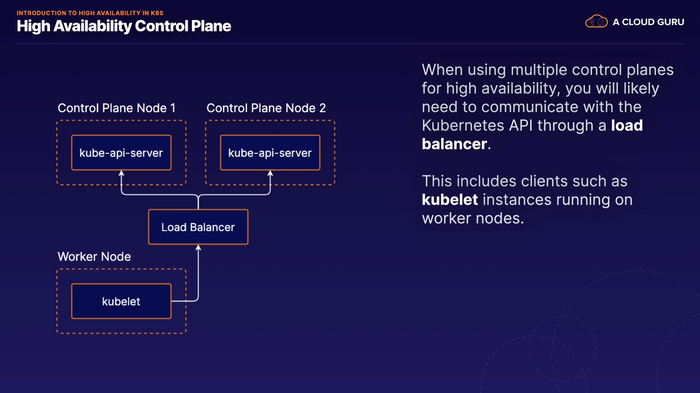
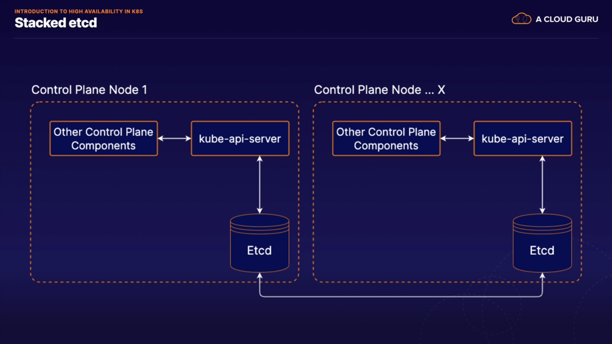
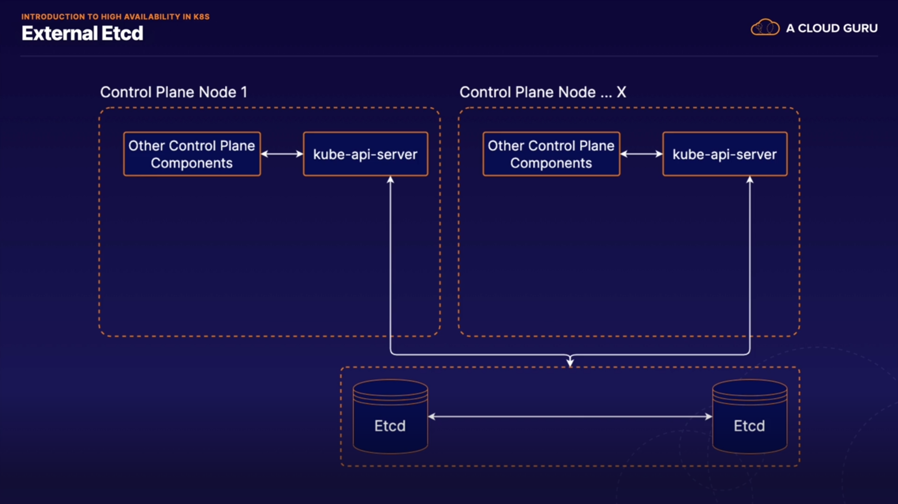

# Intro to High Availability in K8s

## High Availability Control Plane

> K8s facilitates high-availability applications, but you can also design the cluster itself to be highly available.

> To do this, you need multiple control plane nodes.

  - When using multiple conrol planes for high availability, you will likely need to communicate with the K8s API through a load balancer.

  - This includes clients such as `kubelet` instances running on worker nodes

    - Diagram:
    

## Stacked etcd

- etcd runs on the same servers/nodes as the rest of the control plane components.

- kubeadn uses this methodology (this course)

    - Diagram:
    

## External etcd

- etcd runs on completely separate servers/nodes

- we can have multiple etcd nodes in a HA (high availablility) cluster which would be a completely different set of servers that run our normal K8s control plane components.

- with external etcd you can have any number of K8s control plane instances and any number of etcd nodes.

    - Diagram:
    