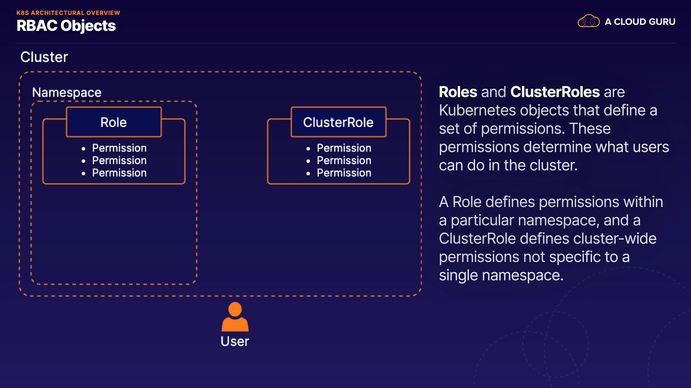

# Managing K8s Role-Based Access Control (RBAC)

> In order to use Kubernetes securely, you may need to exercise granular control over what users can do in your cluster, whether they are human users or automated processes. In this lesson, we will explore Kubernetes’ role-based access control implementation. We will learn how to manage granular permissions within the context of a Kubernetes cluster.

## Lesson Reference
  - [RBAC](https://kubernetes.io/docs/reference/access-authn-authz/rbac/)

---

## RBAC in K8s

> Role-Based access control (RBAC) in K8s allows you to control what users are allowed to do and access within your cluster.

> For example, you can use RBAC to allow developers to read metadata and logs from K8s pods but not make changes to them.

## RBAC Objects




## Hands on Demo

1. Log into control plane and create `role.yml`

  ```YAML
  apiVersion: rbac.authorization.k8s.io/v1
  kind: Role
  metadata:
    namespace: default
    name: pod-reader
  rules:
  - apiGroups: [""]
    resources: ["pods", "pods/log"]
    verbs: ["get", "match", "list"]
  ```

2. Create the role by using `kubectl apply -f role.yml`

  ```
  role.rbac.authorization.k8s.io/pod-reader created
  ```

  *Note: this role provides read access to pods in the "default" namespace*

3. Create a role binding file

  ```YAML
  apiVersion: rbac.authorization.k8s.io/v1
  kind: RoleBinding
  metadata:
    name: pod-reader
    namespace: default
  subjects:               <== This area is where you put the users
  - kind: User
    name: dev
    apiGroup: rbac.authorization.k8s.io
  roleRef:                 <== This area is what role you assign those users
    kind: Role                  i.e. the one you just created above
    name: pod-reader
    apiGroup: rbac.authorization.k8s.io
  ```

4. Run `kubectl apply -f rolebinding.yml` to create the binding

  ```
  rolebinding.rbac.authorization.k8s.io/pod-reader created
  ```